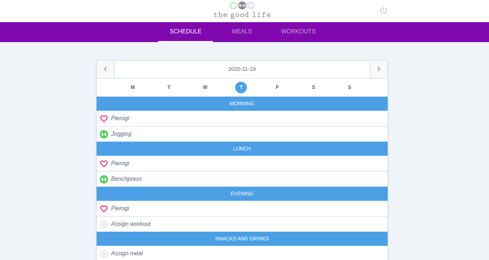
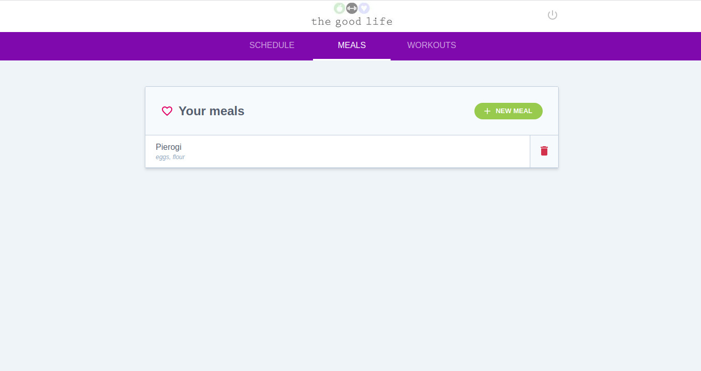
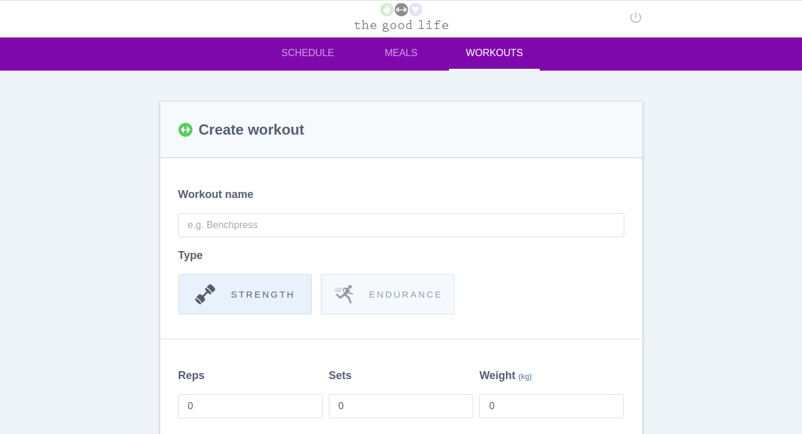

# Angular Fitness Tracker

This is fitness tracker application that provides functionality of managing own meals, workouts and provides a schedule for the day. The app uses Firebase for the user authorization and authentication.

Screenshot 1:

Screenshot 2:

Screenshot 3:

